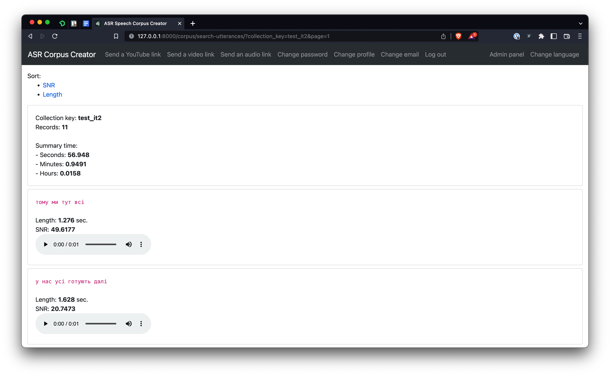

# ASR Corpus Creator

<a href="https://raw.githubusercontent.com/egorsmkv/asr-corpus-creator/main/screenshots/screen1.jpg"></a>

## Overview

This app is intended to automatically create a corpus for ASR systems using pseudo-labeling.

## Features

- Send links of YouTube content
- Send direct links to video/audio from remote servers
- Export labeled data using a console
- `wav2vec2` or `NeMo` servers as an ASR backend

## Installing

### Requirements

- Rust compiler
- CMake
- Protobuf compiler
- Docker
- youtube-dl
- Python >= 3.6

### Clone the project

```bash
git clone https://github.com/egorsmkv/asr-corpus-creator
cd asr-corpus-creator
```

### Install dependencies & activate virtual environment

```bash
# install pipenv if you do not use it already
pip install pipenv

# install dependencies
pipenv install

# activate virtual environment
pipenv shell
```

### Celery

Run Redis broker via docker:

```bash
docker run -d -p 6390:6379 redis
```

### Apply migrations

```bash
python source/manage.py migrate
```

### Create an account

```bash
python source/manage.py createsuperuser
```

### Running

#### WebUI

```bash
python source/manage.py runserver
```

After starting the WebUI, open http://127.0.0.1:8000/ in your browser and log in with credentials you have created on the previous step.

#### Celery

```bash
cd source
WGET_PATH=/opt/homebrew/bin/wget YOUTUBE_DL=/opt/homebrew/bin/youtube-dl FFMPEG_PATH=/opt/homebrew/bin/ffmpeg celery -A app worker -l INFO --concurrency 1
```

You can set a higher value to the `concurrency` argument if you need the system to be more performant.

### ZeroMQ server

Choose one server from the below two.

#### wav2vec2

```bash
python zmq_server_w2v2.py
```

#### NeMo

```bash
python zmq_server_nemo.py
```

##### With a language model

Download `unigrams.txt` and `lm.binary` files.

Then, run as:

```bash
USE_LM=yes LM_UNIGRAMS_FILE=unigrams.txt LM_FILE=lm.binary python zmq_server_nemo.py
```

### Export the data

```bash
FILES_DIR=/Users/yehorsmoliakov/Work/asr-corpus-creator/source/content/media/audios/ python source/manage.py export_utterances_as_jsonl test_it2 > records.jsonl
```

- **test_it2** is the collection_key argument.
