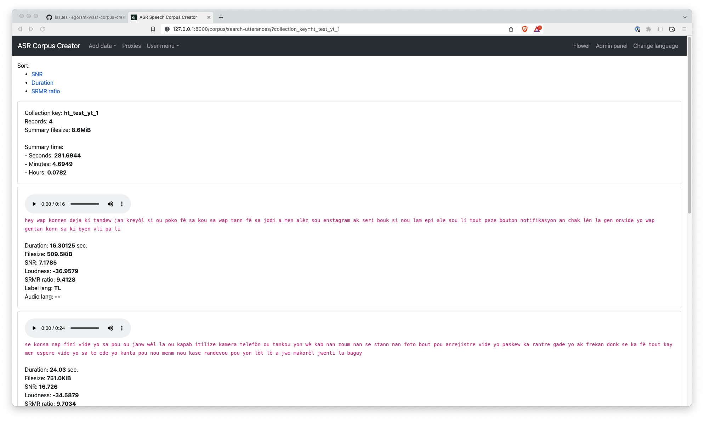

# ASR Corpus Creator

[](https://doi.org/10.5281/zenodo.7396705)

<a href="https://raw.githubusercontent.com/egorsmkv/asr-corpus-creator/main/screenshots/screenshot.png"></a>

## Overview

This app is intended to automatically create a corpus for ASR systems using [pseudo-labeling][1].

## Features

- Send links of YouTube content or even an entire channel
- Send direct links to video/audio from remote servers
- Send local folders
- Collect metadata
  - Loudness
  - Label language detection
  - Audio language detection
  - SRMR ratio (measure reverberation)
- Export labeled data using a console
- `whisper`, `wav2vec2`, or `NeMo` as an ASR backend

## Installing

### Requirements

- Rust compiler
- CMake
- Protobuf compiler
- Docker
- wget
- youtube-dl or yt-dlp
- ffmpeg
- Python >= 3.6

### Clone the project

```bash
git clone https://github.com/egorsmkv/asr-corpus-creator
cd asr-corpus-creator
```

### Installation

#### On MacOS

Install `grpcio` like the following:

```bash
pip install https://github.com/pietrodn/grpcio-mac-arm-build/releases/download/1.50.0/grpcio-1.50.0-cp310-cp310-macosx_11_0_arm64.whl
```

NOTE: Visit https://github.com/pietrodn/grpcio-mac-arm-build repository's releases to see different wheels for your Python version.

#### Install dependencies & activate virtual environment

```bash
# install pipenv if you do not use it already
pip install pipenv

# activate virtual environment
pipenv shell

# install Cython first
pip install Cython==0.29.32

# install dependencies
pipenv install

# or install dependencies with ability to see the installation process
pip install Django==4.1.3 django-bootstrap4==22.2 celery==5.2.7 redis==4.3.3 librosa==0.9.1 torch==1.13.0 torchaudio==0.13.0 pyzmq==23.1.0 transformers==4.20.1 loguru==0.6.0 psutil==5.9.1 pyctcdecode==0.3.0 'nemo-toolkit[asr]==1.12.0' git+https://github.com/openai/whisper.git lingua-language-detector==1.1.3 git+https://github.com/csteinmetz1/pyloudnorm
```

### Apply migrations

```bash
python source/manage.py migrate
```

### Create an account

```bash
python source/manage.py createsuperuser
```

### Running

#### WebUI

```bash
python source/manage.py runserver
```

After starting the WebUI, open http://127.0.0.1:8000/ in your browser and log in with credentials you have created on the previous step.

#### Celery

Run Redis broker via docker:

```bash
docker run -d -p 6390:6379 redis
```

Run the worker (with `youtube-dl`):

```bash
cd source
HF_TOKEN=xxxx WGET_PATH=/opt/homebrew/bin/wget YOUTUBE_DL=/opt/homebrew/bin/youtube-dl FFMPEG_PATH=/Users/yehorsmoliakov/opt/miniconda3/bin/ffmpeg celery -A app worker -l INFO --concurrency 1
```

Run the worker (with `yt-dlp`):

```bash
cd source
HF_TOKEN=xxxx WGET_PATH=/opt/homebrew/bin/wget YT_DLP=/opt/homebrew/bin/yt-dlp FFMPEG_PATH=/Users/yehorsmoliakov/opt/miniconda3/bin/ffmpeg celery -A app worker -l INFO --concurrency 1
```

Run the worker with audio language detection:

```bash
cd source
HF_TOKEN=xxxx DETECT_AUDIO_LANG=yes WGET_PATH=/opt/homebrew/bin/wget YOUTUBE_DL=/opt/homebrew/bin/youtube-dl FFMPEG_PATH=/Users/yehorsmoliakov/opt/miniconda3/bin/ffmpeg celery -A app worker -l INFO --concurrency 1
```

You can set a higher value to the `concurrency` argument if you need the system to be more performant.

### ZeroMQ server

Choose one server.

#### Whisper

```bash
WHISPER_LANG=en WHISPER_MODEL=base python zmq_server_whisper.py
```

#### wav2vec2

```bash
python zmq_server_w2v2.py
```

#### NeMo

```bash
python zmq_server_nemo.py
```

##### With a language model

Download `unigrams.txt` and `lm.binary` files.

Then, run as:

```bash
USE_LM=yes LM_UNIGRAMS_FILE=unigrams.txt LM_FILE=lm.binary NEMO_MODEL=theodotus/stt_uk_squeezeformer_ctc_ml python zmq_server_nemo.py
```

### Push new files from a folder to the processing

Structure of the command:

```bash
python source/manage.py push_to_processing <collection_key> <lang> <folder_path>
```

Example:

```bash
python source/manage.py push_to_processing cv10 uk /Users/yehorsmoliakov/Downloads/test-folder
```

You can configure a CRON command to push new files with the above command.

### Task monitoring

If you want to monitor running tasks, then install Flower:

```bash
pip install flower
```

and run it like the following:

```bash
cd source
nohup celery -A app flower -l INFO --concurrency 1 --port=5566 > /tmp/flower.log 2> /tmp/flower_errors.log < /dev/null &
```

then go to http://localhost:5566 to browse Flower.

### Export the data

```bash
FILES_DIR=/Users/yehorsmoliakov/Work/asr-corpus-creator/source/content/media/audios/ python source/manage.py export_utterances_as_jsonl test_it2 > records.jsonl
```

- **test_it2** is the collection_key argument.

### Classify utterances to get content audio type

```bash
python source/manage.py classify_utterances <collection_type> <device_id>

# for example:
python source/manage.py classify_utterances yt-split7 cpu
python source/manage.py classify_utterances yt-split7 cuda:0
```

This command will classify utternaces using the AST model to get content type (Speech, Music, Bicycle bell, etc) from audio files.

[1]: https://ai.facebook.com/blog/pseudo-labeling-speech-recognition-using-multilingual-unlabeled-data/
